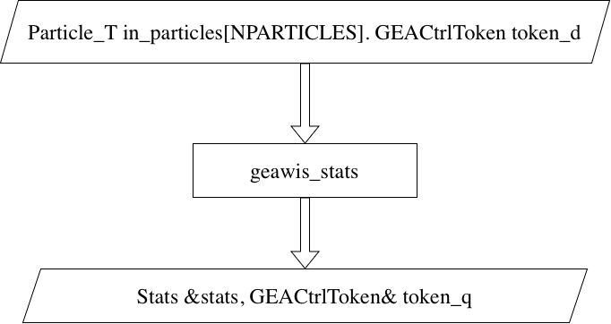

# L1 TEST PROJECT

<p align="center">
    
</p>

- `StatsAlgo` Architecture

This block directly receives 128 PUPPI candidates and control token, and produces a Stats object.

## Simulation
The setup is trivial - it simply generates a dataset with random values distributed uniformly and sends it to Vitis.

### 1. Setup `geawis`
The first step is to set up geawis.
```
git clone git@github.com:SridharaDasu/geawis.git
cd geawis
```

### 2. Run csim to verify that the testbench "simulation" agrees with the code used to make the "RTL".

In this step we run csim using vitis. Compiling requires access to datatypes.h, which is in CMSSW area. If you are working on a machine with /cvmfs it should work fine. As for the access to Vitis / Vivado, you need to execute the local settings script. The example below works on Wisconsin lab machines.
```
source /afs/hep.wisc.edu/cms/sw/Xilinx/Vivado/2023.1/settings64.sh
vitis_hls -f run_csim.tcl "{nevents=1000}"
```

### 3. Generate "RTL"

This generates the firmware RTL, which is to be used with the core framework to produce a bitfile eventually.
```
source /afs/hep.wisc.edu/cms/sw/Xilinx/Vivado/2023.1/settings64.sh
vitis_hls -f run_csynth.tcl
```
