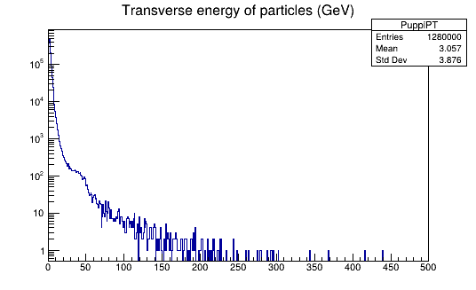
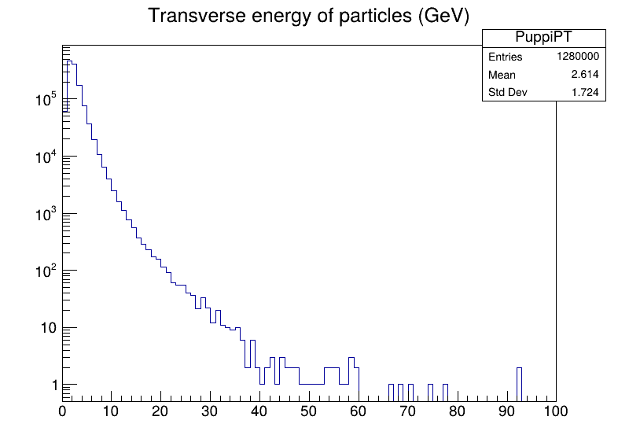
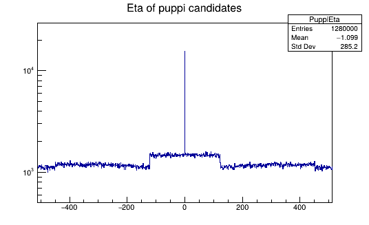
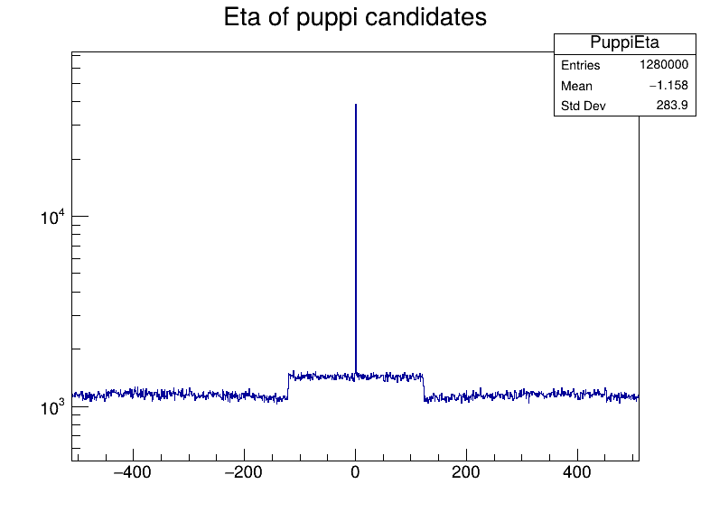
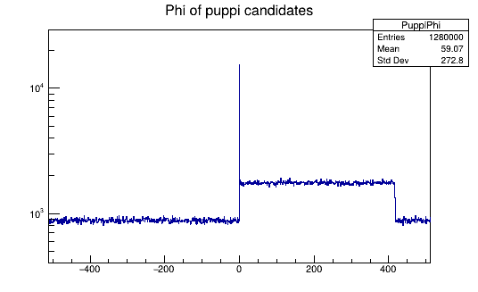
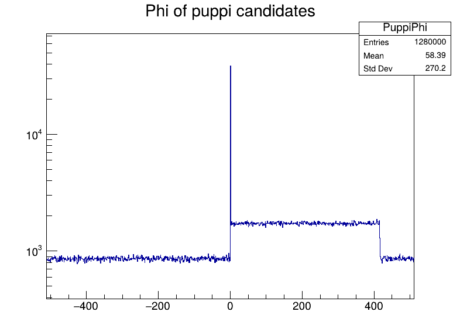
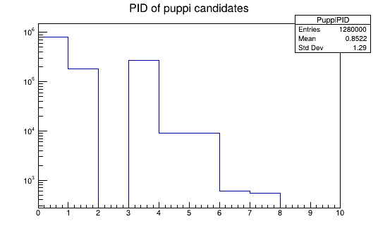
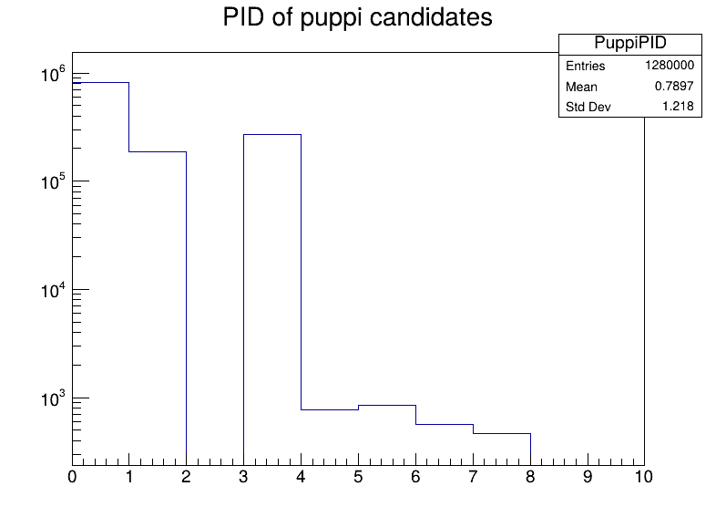

# Pythia8 and UltraFastSim based puppi candidate data generator

The minbias.cards and hlhc-z.cards are setup to simulate proton-proton
collisions at 13.6 TeV. These are Pythia8 data cards. You can generate
other types of signal events with the program as long as Pythia8
understands those files.

One can make minbias events with minbias.cards.

The output of generateData program, using any of the <tag>.cards files are
the files <tag>.csv with 128  puppi candidates per event and <tag>.root
with histograms of those quantities.

You can use minbias data to learn about the backgrounds. Hopefully, the
anomaly detection algorithm can be used to distinguish the backgrounds from
any type of signal.

Histograms from hllhc-z.root and minbias.root:

    
    

    
    

    
    

    
    

